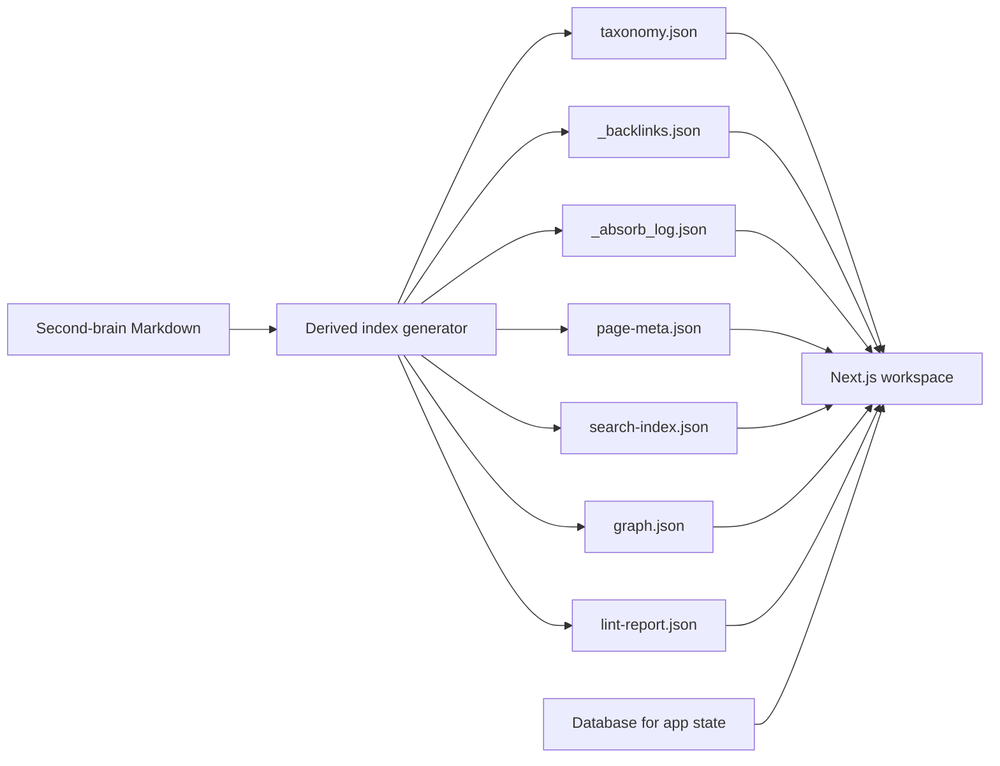

# Second Brain Web Workspace Design

Date: 2026-04-12
Status: Revised after `llm_wiki` alignment
Owner: Codex

## Summary

Build a public-hosted but login-protected web workspace for the existing second-brain knowledge base. The product target is no longer just a Wikipedia-like reader. It is a browser-based knowledge workbench inspired by `llm_wiki`:

- left navigation tree for knowledge and sources
- center workspace for chat, search, review, and deep research
- right preview and context panel for page rendering, backlinks, sources, and absorb state

The current Markdown wiki remains the source of truth. A derived system layer generates machine indexes such as taxonomy, backlinks, absorb tracking, page metadata, search corpus, and graph data. The web app consumes those derived artifacts and adds authenticated collaboration state such as chat sessions and review queues.

Deployment target is Vercel. Authentication target is Auth.js with Google sign-in and an email allowlist.

## Goals

- Keep the current second-brain Markdown corpus as the authoritative knowledge source.
- Add a derived system layer that supports a workspace product instead of a plain article viewer.
- Deliver a web application structurally close to `llm_wiki`, not just visually close to Wikipedia.
- Include these v1 workbench capabilities:
  - wiki browsing
  - source browsing
  - full-text search
  - graph view
  - lint view
  - review queue
  - deep research
  - multi-session chat
- Make the site publicly reachable on the internet but require login for all content access.
- Preserve the current maintenance workflow so future curation updates both Markdown content and derived indexes.

## Non-Goals

- Do not replace the current second-brain directory layout as the primary authoring structure.
- Do not expose raw or first-brain read-only sources directly to site visitors.
- Do not make the site publicly readable without authentication.
- Do not create a second manually maintained wiki in parallel with the current one.
- Do not make the web UI the source of truth for knowledge content in v1.

## Alignment With `llm_wiki`

The target product should align with the public description of `llm_wiki` in these ways:

- three-column layout
- knowledge tree and source tree navigation
- chat-centered workflow
- preview pane with context
- workspace modules such as Wiki, Sources, Search, Graph, Lint, Review, Deep Research, and Settings

The target product should differ from `llm_wiki` in these ways:

- web-first deployment instead of a Tauri desktop shell
- strict login gate for internet access
- current second-brain Markdown as the source of truth
- derived indexes generated from the existing wiki instead of adopting a new authoring filesystem

## Current State

The current knowledge base already has a stable authoring structure:

- `人物/`
- `概念/`
- `工具/`
- `项目/`
- `想法/`
- `写作/`
- `来源/`
- `收件箱/`
- `归档/`
- root entry files such as `README.md`, `index.md`, `log.md`, `AI维护指令.md`

There is also:

- a raw read-only input layer
- a first-brain read-only layer reachable through `.base` references and linked pages
- an existing maintenance process that compiles raw material into source pages and then into formal knowledge pages

This means the knowledge system already works. What is missing is a derived data layer and an app shell.

## Product Shape

Use a three-layer architecture:

1. Authoring layer
   - existing second-brain Markdown corpus
   - human-maintained and AI-maintained
   - source of truth
2. Derived system layer
   - generated JSON indexes and normalized page artifacts
   - rebuilt from the authoring layer
   - powers navigation, search, backlinks, graphing, absorb tracking, linting, and provenance
3. Presentation and interaction layer
   - Next.js web application
   - authenticated app shell
   - stores chat state, review state, settings, and deep-research jobs

This keeps the knowledge base authoritative while still allowing application-style behavior.

## Proposed Directory Layout

### Existing second-brain root

```text
ai知识库（第二大脑）/
  人物/
  概念/
  工具/
  项目/
  想法/
  写作/
  来源/
  收件箱/
  归档/
  README.md
  index.md
  log.md
  AI维护指令.md
  .wiki-system/
    taxonomy.json
    _backlinks.json
    _absorb_log.json
    page-meta.json
    search-index.json
    graph.json
    lint-report.json
    aliases.json
```

### New web app

```text
wiki-ui/
  app/
    (auth)/
    workspace/
    api/
  components/
  lib/
  scripts/
  generated/
  prisma/
  public/
  auth.ts
  middleware.ts
  package.json
  next.config.ts
```

`generated/` in the web app is a deployment copy of the latest derived artifacts and rendered page payloads.

## Why The Existing Directory Layout Stays

The current top-level structure remains the authoring structure because it already provides:

- stable content boundaries for maintenance
- compatibility with existing links and rules
- a workable MECE model for formal knowledge pages

The requested natural-growth taxonomy becomes a derived navigation system, not a mandatory replacement for the underlying filesystem.

## Derived System Layer

### 1. `taxonomy.json`

Purpose:

- provide a natural-growth knowledge tree for the left sidebar
- support multiple thematic entry points without forcing a filesystem migration

Generation inputs:

- file path and primary category
- frontmatter tags and sources
- normalized wikilinks
- heading structure
- shared-link clusters
- source co-occurrence
- update recency

Output shape:

```json
{
  "version": 1,
  "generatedAt": "2026-04-12T22:00:00+08:00",
  "roots": [
    {
      "id": "ai-toolchain",
      "title": "AI Toolchain",
      "children": [
        {
          "id": "openclaw",
          "title": "OpenClaw",
          "pages": ["工具/OpenClaw.md"]
        },
        {
          "id": "obsidian-workflows",
          "title": "Obsidian Workflows",
          "pages": [
            "概念/Obsidian生产力系统.md",
            "工具/Obsidian-Web-Clipper.md"
          ]
        }
      ]
    }
  ]
}
```

Rules:

- one page may appear in multiple branches
- taxonomy is display-oriented
- generation must be deterministic
- later manual overrides are allowed, but not required for v1

### 2. `_backlinks.json`

Purpose:

- power "What links here"
- power the right-side backlinks panel
- support related-page ranking
- feed graph generation

Generation inputs:

- explicit `[[wikilinks]]`
- local Markdown links
- alias resolution
- source-to-article and article-to-source relationships

Output shape:

```json
{
  "version": 1,
  "generatedAt": "2026-04-12T22:00:00+08:00",
  "pages": {
    "概念/Obsidian生产力系统.md": {
      "title": "Obsidian生产力系统",
      "incoming": [
        "来源/2026-04-12-第一大脑剪藏与记录规则.md",
        "概念/个人学习管理.md"
      ],
      "outgoing": [
        "工具/Obsidian-Web-Clipper.md",
        "项目/飞书记录系统.md"
      ],
      "related": [
        "工具/Obsidian-CodeX-Agent.md"
      ]
    }
  }
}
```

### 3. `_absorb_log.json`

Purpose:

- track raw-to-source-to-article absorption state
- support maintenance QA
- support review queues
- support future provenance views inside the UI

Primary states:

- `pending`
- `read`
- `absorbed`
- `expanded`
- `skipped`

Output shape:

```json
{
  "version": 1,
  "generatedAt": "2026-04-12T22:00:00+08:00",
  "entries": {
    "raw/某来源/xxx.md": {
      "status": "expanded",
      "sourcePage": "来源/2026-04-12-某主题.md",
      "compiledInto": [
        "概念/AI知识库构建.md",
        "项目/飞书记录系统.md"
      ],
      "lastAbsorbedAt": "2026-04-12T21:30:00+08:00",
      "notes": "Already entered source layer and expanded into two formal knowledge pages",
      "confidence": 0.84
    }
  }
}
```

Backfill sources:

- raw path inventory
- source pages under `来源/`
- `sources:` frontmatter in formal pages
- historical notes from `log.md`

### 4. `page-meta.json`

Contains normalized page metadata:

- canonical path
- title
- category
- aliases
- tags
- updated date
- source references
- abstract
- headings
- renderable slug

### 5. `search-index.json`

Contains the normalized search corpus:

- title terms
- aliases
- abstract
- headings
- high-value body terms
- category filters
- tag filters

### 6. `graph.json`

Purpose:

- power the graph workspace

Contains:

- node metadata
- edge list
- edge types such as `wikilink`, `source_ref`, `absorbed_into`, `related`

### 7. `lint-report.json`

Purpose:

- power the lint workspace

Contains:

- broken links
- orphan pages
- duplicate candidates
- weakly connected pages
- pages with missing source references
- pages with stale metadata

### 8. `aliases.json`

Maps ambiguous link text and alternative titles to canonical pages.

## Web App Design

## App Shell

The app shell is the default product entry, not a marketing homepage.

Layout:

- left sidebar
  - workspace switcher
  - knowledge tree
  - source tree
  - taxonomy tree
- center panel
  - active workspace
  - chat, search, review, deep research, or graph controls
- right panel
  - preview renderer
  - page metadata
  - backlinks
  - source references
  - absorb status

The shell must feel like a knowledge workstation rather than a static documentation site.

## Core Workspaces

### 1. Wiki

Responsibilities:

- browse formal knowledge pages
- render article content
- navigate by taxonomy, links, and related pages

### 2. Sources

Responsibilities:

- browse absorbed source summaries
- inspect provenance without exposing raw storage
- trace which formal pages a source contributes to

### 3. Search

Responsibilities:

- instant keyword search
- category and tag filters
- result ranking using metadata and link density

### 4. Graph

Responsibilities:

- visualize relationships between pages
- pivot by category, source, or selected node
- inspect graph edges and jump back into preview

### 5. Lint

Responsibilities:

- show structural problems in the knowledge base
- prioritize broken links, orphan pages, stale pages, and duplicate candidates

### 6. Review

Responsibilities:

- present items that need human or AI review
- surface uncertain absorb mappings
- surface pages with weak provenance or ambiguous categorization

### 7. Deep Research

Responsibilities:

- start focused research jobs for known knowledge gaps
- fetch external materials
- summarize into candidate source pages
- propose insertion into the wiki without writing directly to the authoritative corpus

### 8. Chat

Responsibilities:

- let the user query the knowledge base conversationally
- quote or cite relevant pages
- open selected pages in preview
- persist chat sessions

### 9. Settings

Responsibilities:

- account and allowlist diagnostics
- model provider settings
- index status
- sync status

## Article Rendering

The preview area should combine two influences:

- `llm_wiki` style workbench preview behavior
- Wikipedia-style content density and link affordances

Requirements:

- strong typography for long reading
- table of contents
- infobox-like metadata panel where useful
- visible internal links
- visible source references
- visible backlinks

## Data Flow



## Database Boundary

The app needs a database for interactive state. Markdown and derived JSON are not enough for workspace behavior.

Database-backed state in v1:

- user sessions
- allowlisted user records
- chat threads and messages
- review item status
- deep research job status and outputs
- saved workspace preferences

Not stored in the database in v1:

- canonical knowledge article content
- raw source files
- first-brain read-only materials

## Authentication And Access Control

Chosen approach:

- Vercel deployment
- Auth.js
- Google provider
- email allowlist

Requirements:

- all routes require authentication
- only explicitly allowlisted Google accounts may access the app
- robots indexing disabled
- unauthenticated users cannot see content payloads

## Deployment Model

Target:

- Next.js app hosted on Vercel
- custom domain or Vercel domain
- reachable from any device over the public internet after login

Build model:

- generate derived artifacts from the second-brain workspace
- sync them into `wiki-ui/generated/`
- deploy the app with those artifacts and app-state database access

## Maintenance Flow

### Existing workflow to preserve

- raw read-only material is absorbed into `来源/`
- source summaries are compiled into formal knowledge pages
- `index.md` and `log.md` are updated after maintenance

### New workflow after this project

Each maintenance cycle should also:

1. regenerate `.wiki-system/page-meta.json`
2. regenerate `.wiki-system/aliases.json`
3. regenerate `.wiki-system/taxonomy.json`
4. regenerate `.wiki-system/_backlinks.json`
5. update `.wiki-system/_absorb_log.json`
6. regenerate `.wiki-system/graph.json`
7. regenerate `.wiki-system/lint-report.json`
8. sync generated artifacts into the web app

## Conversion Strategy

### Phase 1: Derived index generator

Create a generator that scans the current second-brain root and produces:

- `page-meta.json`
- `aliases.json`
- `taxonomy.json`
- `_backlinks.json`
- `_absorb_log.json`
- `search-index.json`
- `graph.json`
- `lint-report.json`

### Phase 2: Historical backfill

Reconstruct existing absorb state from:

- current raw inventory
- source pages in `来源/`
- existing `sources:` references
- `log.md`

Backfill should support partial certainty and explicit notes.

### Phase 3: App shell

Build the authenticated three-column workspace and wire it to generated data.

### Phase 4: Interactive modules

Add chat, review, graph, lint, and deep research modules.

### Phase 5: Ongoing synchronization

Integrate generator execution into the maintenance workflow so each curation pass refreshes app data.

## Risks And Mitigations

### Risk: taxonomy quality is noisy early on

Mitigation:

- use deterministic heuristics first
- allow manual override later

### Risk: historical absorb mapping is incomplete

Mitigation:

- record confidence and notes in the absorb log
- route uncertain items into Review

### Risk: page identity collisions

Mitigation:

- keep canonical path identity
- normalize aliases
- flag ambiguous titles during generation

### Risk: leaking private content

Mitigation:

- all routes behind auth
- no raw exposure
- no first-brain exposure
- allowlist enforcement at auth boundary

### Risk: UI and source wiki drift apart

Mitigation:

- UI stays read-only for canonical content in v1
- derived indexes regenerate from source
- review and deep-research outputs remain proposals until promoted into the wiki

### Risk: v1 scope is broad

Mitigation:

- implement each workspace with a thin but complete first pass
- do not overbuild editors or collaboration features in v1

## Implementation Boundaries For v1

Must include:

- authenticated app shell
- three-column layout
- wiki workspace
- sources workspace
- search workspace
- graph workspace
- lint workspace
- review workspace
- deep research workspace
- multi-session chat workspace
- generated taxonomy
- generated backlinks
- generated absorb log

Can wait until later:

- inline page editing in the UI
- multi-user editorial workflow
- advanced semantic search ranking
- manual taxonomy editor
- graph collaboration tools

## Acceptance Criteria

- the current second-brain Markdown corpus remains intact and authoritative
- `.wiki-system/` can be regenerated from the source corpus
- the web app launches into a three-column authenticated workspace
- the left sidebar exposes knowledge tree, source tree, and taxonomy
- the center panel supports Wiki, Sources, Search, Graph, Lint, Review, Deep Research, and Chat
- the right panel renders preview, backlinks, source references, and absorb state
- the app is reachable from other devices over the public internet
- every route requires Google sign-in and email allowlist approval
- future maintenance can update both Markdown content and derived indexes without structural conflict

## Recommendation

Proceed with a `llm_wiki`-inspired web workspace built on top of the current second-brain Markdown corpus and a generated `.wiki-system` layer. This is the lowest-risk way to satisfy the user's requirements for taxonomy, backlinks, absorb tracking, web deployment, login protection, and workbench-style interaction.
